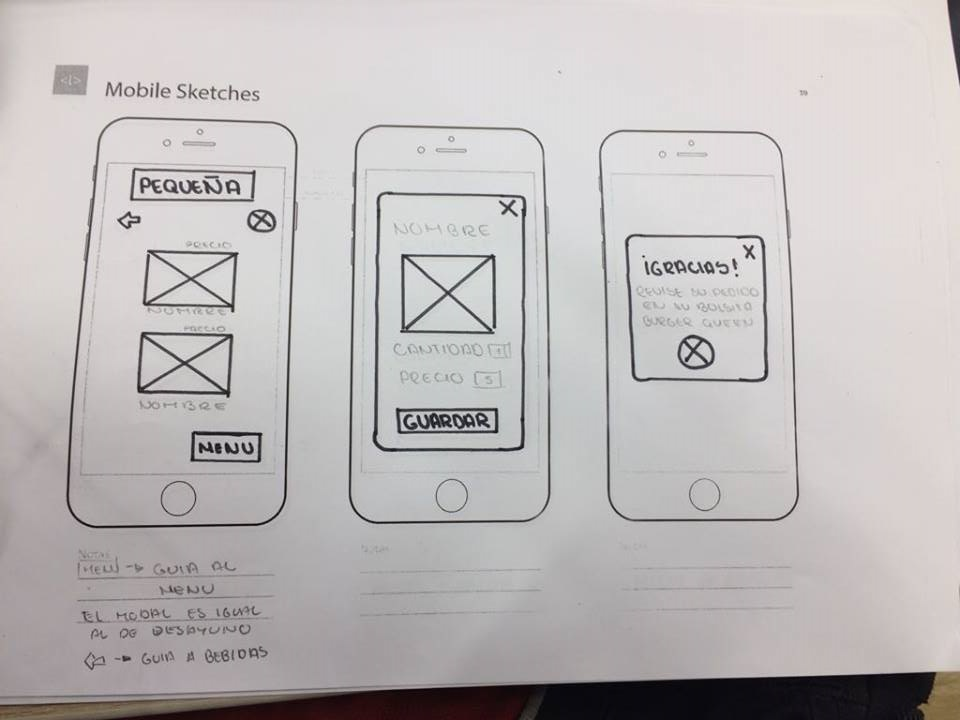
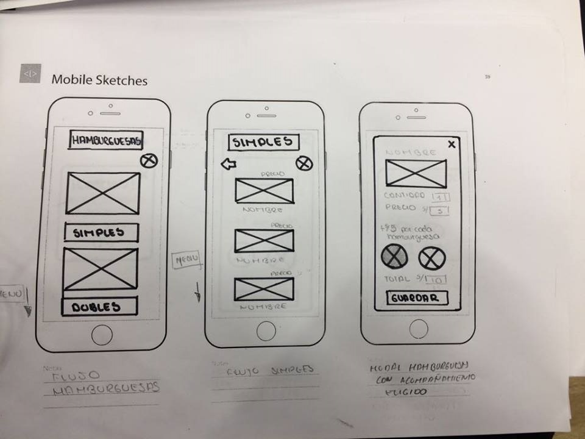
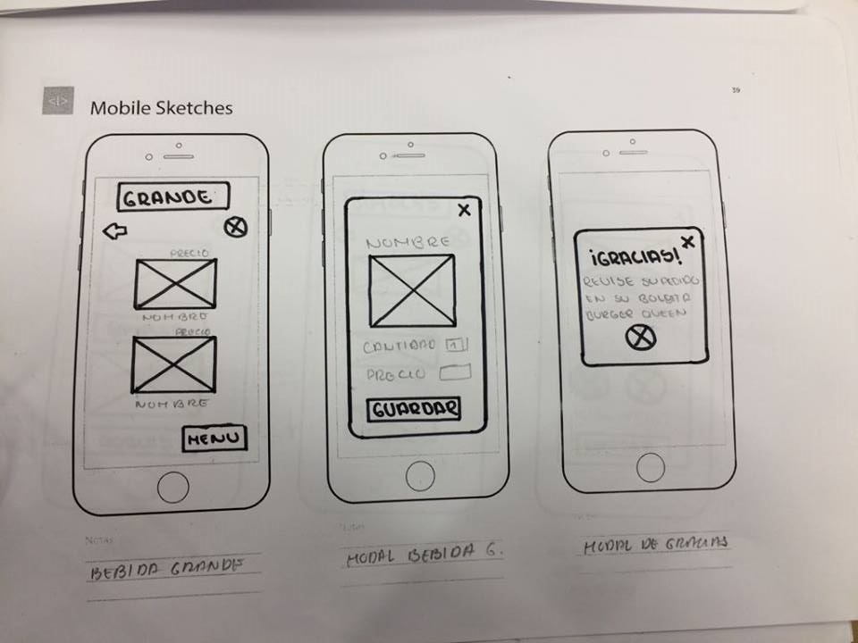

# BURGUER QUEEN

* **Track:** _Especialización Front-end_
* **Curso:** _REACT_
* **Unidad:** _RETO_

***

## Introducción :
Este proyecto consiste en implementar un app para un sitio de comida rápida que ayude a tomar los pedidos de los clientes; como requisitos se pide : 
* Tener dos menús.
* Diseño responsive y mobile.
* Estar desarrollada íntegramente en ES6 y empaquetada de manera automatizada con babel o webpack.
* Utilizar React y Redux.
* Con por lo menos 10 componentes que especifiquen todas sus props, 3 reducers no atomicos (JSON) y 3 actions.
* Contar con los scripts necesarios.

## PLAN DE TRABAJO : 

El proyecto se realizó en un sprint y para ello se propuso dividir el proyecto en una serie de etapas que se detallarán a continuación :

#### ETAPA 1 : 
* Dibujar el sketch del proyecto ( imagen adjunta al final de esta etapa).
* Elección de colores y tipografías (Especificados en el tablero Trello).
* Planificación de los puntos a  presentar en el readme.
* Crear issues y milestones que sirvan como hoja de ruta (roadmap).
* Creación de un tablero  en TRELLO con la planificaión del proyecto.

## Sketchs del flujo de la aplicación :

#### ETAPA 2 :

* Fork del repositorio del proyecto.
* Añadir la estructura del proyecto, con carpetas y archivos necesarios.
* Crear issues y milestones que sirvan como hoja de ruta (roadmap).
* Primera versión del readme.

### ETAPA 3 :

### ETAPA 4 :

* Versión final README.

## Archivos importantes

El proyecto presenta los siguientes archivos para uso del usuario:

* `README.md` con descripción del proyecto, imagenes del mismo y organización del equipo.
* `index.html`: Donde se encuentra la vista principal del proyecto.
* `src`: Carpeta que contiene el área de desarrollo del proyecto. 
* `components`: Carpeta que contiene los componentes del proyecto , cada uno con una hoja de estilos en un archivo con el nombre del componente.

## Imagenes del proyecto :

* Vista principal :

## Demo
Para ver el demo dar click [aquí]( "titulo")

## Autoras

* Manuela Flores Vilchez [Cuenta GitHub ](https://github.com/ManuelaFlores "titulo")
* Lilliam Haro Bernal [Cuenta GitHub ]( https://github.com/LilliamHaro "titulo")
* Patricia Urco Ochoa [Cuenta GitHub ](https://github.com/Patty8909 "titulo")

